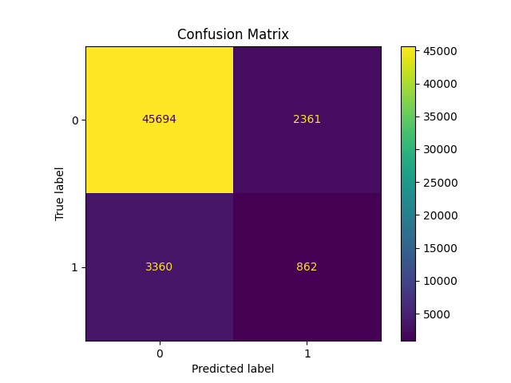
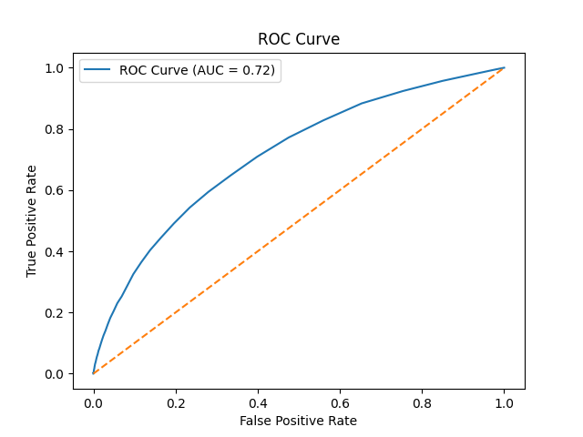

#  Credit Risk Scoring Model using Machine Learning

## Project Overview

This project focuses on building a **Credit Risk Scoring System** that predicts whether a loan applicant is likely to **default** or **repay** the loan.

The model is designed to help financial institutions make **data-driven decisions** by balancing:

* Risk (loan defaults)
* Profit (loan approvals)

---

## 📊 Dataset Information

*  Source: Kaggle Credit Scoring Dataset
*  Records: **261,384**
*  Features: **122**
*  Target:

  * `0` → Non-Defaulter (Safe)
  * `1` → Defaulter (Risky)

 The dataset is **imbalanced**:

* 91.9% Non-default
* 8.1% Default

---

## ⚙️ Tech Stack

*  Python
*  Pandas, NumPy
*  Scikit-learn
*  Matplotlib, Seaborn
*  Jupyter Notebook

---

##  Machine Learning Pipeline

### 🔹 Data Preprocessing

* Handled missing values using **SimpleImputer**
* Encoded categorical variables using **OneHotEncoder**
* Removed high-missing and irrelevant features
* Built clean preprocessing pipeline using **ColumnTransformer**

---

###  Feature Engineering

* Created:

  * **Debt-to-Income Ratio**
  * **Payment Ratio**
  * **Employment Years**
* These features help capture **financial stability and repayment ability**

---

###  Models Implemented

* Logistic Regression (baseline)
* Decision Tree Classifier
* Random Forest Classifier  (Best Model)

---

##  Model Performance

###  Final Model: Random Forest Classifier

*  ROC-AUC Score: **~0.715**
*  Threshold Tuned: **0.2**

---

###  Final Confusion Matrix

```
[[45694  2361]
 [ 3360   862]]
```

---

### 📋 Classification Report

```
              precision    recall    f1-score
Non-Default     0.93       0.95       0.94
Default         0.27       0.20       0.23
```

---

## ⚖️ Threshold Optimization (Key Insight)

Different thresholds were tested:

| Threshold | Behavior                               |
| --------- | -------------------------------------- |
| 0.1       | High risk detection, many false alarms |
| 0.2 ✅     | Balanced (Final choice)                |
| 0.3       | Conservative, misses defaulters        |

👉 **Why important?**
In credit scoring:

* Missing a defaulter = high loss
* Rejecting a good customer = opportunity loss

---

##  Feature Importance (Top Factors)

* external_source_2
* external_source_3
* Age (days_birth)
* Employment history
* Debt-to-income ratio
* Loan amount & annuity

👉 External credit bureau scores were the **strongest predictors**

---

##  Business Impact

This model helps banks:

* ✅ Identify high-risk customers
* ✅ Reduce loan defaults
* ✅ Improve approval strategy
* ✅ Balance risk vs profit

---

## 🚀 How to Run

```bash
# Clone repository
git clone https://github.com/areebotix/Credit_Scoring_Model.git

# Navigate to project
cd Credit_Scoring_Model

# Install dependencies
pip install -r requirements.txt

# Run notebook
jupyter notebook
```

---

##  Project Structure

```
Credit_Scoring_Model/
│
├── data/
├── notebooks/
├── models/
├── src/
├── README.md
├── requirements.txt
└── .gitignore
```

---

## 🎯 Key Learnings

* Handling **imbalanced datasets**
* Importance of **evaluation metrics beyond accuracy**
* Real-world trade-offs in **credit risk modeling**
* Power of **ensemble models (Random Forest)**
* Business impact of **threshold tuning**

## 📊 Results

### Confusion Matrix


### ROC Curve


---

## 👨‍💻 Author

**Areeba Khan**

---

## ⭐ If you like this project

Give it a star ⭐ on GitHub and feel free to connect!
